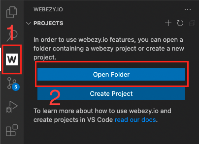
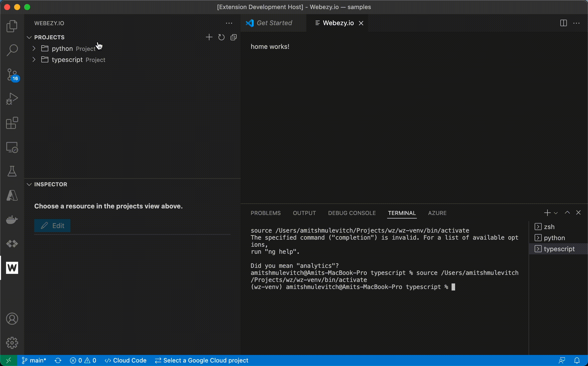

# Webezy.io

This is an extension for [webezy.io CLI](https://www.webezy.io) to create manage and deploy your projects with visual represntations and helpers.

## Requirements

This extension using and levreging the webezy.io cli.
You can install the webezy.io cli after [free login](https://www.webezy.io)

## Documentation

For a deeper dive into how this extension can be used in your already exisiting webezy.io projects

- [CLI documentation](https://www.webezy.io/docs/cli)
- [vscode extension](https://www.webezy.io/docs/vscode)

### Usage

Once webezy extension is installed on your vscode editor [VSCode Marketplace](https://marketplace.visualstudio.com/items?itemName=webezy.vscode-webezy)
you can open a folder that holds one or more webezy.io projects.
This folder can be a workspace folder for your all webezy.io projects.

1. Click on the webezy icon at the `Activity Bar` (The outer-left navigation bar), it will activate your webezy.io extension and will open up a fiew views and vscode integrated terminal for each of your projects inside the "Root folder".

2. Open up a folder which holding one or more webezy.io projects

## Features

Webezy.io vscode extension provide both a wrapper to the CLI and a custom addiotional views to your loved vscode editor.

This extension can be used to create and edit webezy.io projects or just as a co-pilot for easy navigation in your project resources.

Open webezy.io panel from `Activity Bar`:

> Note: At the first time your webezy.io extension has been activated you will need to choose a `Python` interpreter which webezy CLI is insatlled at.

Projects view + Resource inspector view:

> Tip: Some commands are available through the command pallate (windows `Ctrl+Shift+P` or MacOS `⌘+⇧+P`) try running `webezy: Display Version` to get your current installed webezy CLI in your environment. 

## Release Notes

### 0.0.1

Initial release of vscode-webezy extension

### 0.0.2

Initial release of creating new project 

### 0.0.3

Added documentations

---
_Created with love by Amit Shmulevitch. 2022 © webezy.io_

**Enjoy!** 
