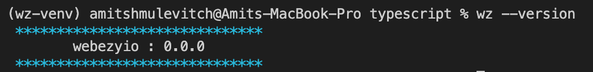

## webezy.io CLI

Is the `Engine` behind `webezy.io vscode` extension, it is used in several commands such as creating resources.

Get started and install NOW the CLI from [here](https://www.webezy.io).

After installation to your preffered environment using [`pip`](https://packaging.python.org/en/latest/tutorials/installing-packages/) you can continue and use the extension with all of it's mighty.

Useful Resources :

- [CLI Docs](https://www.webezy.io/docs/cli)
- [VSCode Extension Docs](https://www.webezy.io/docs/vscode)


### Verify Installation

Verify that the installation process has been succesful and run the following command :

```sh
webezy --version
```

> it should result with

